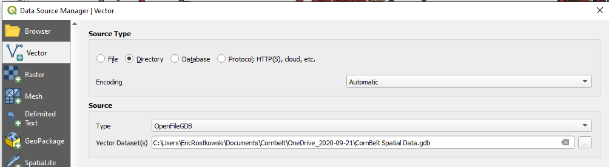
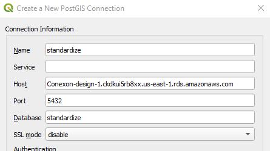
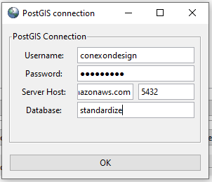
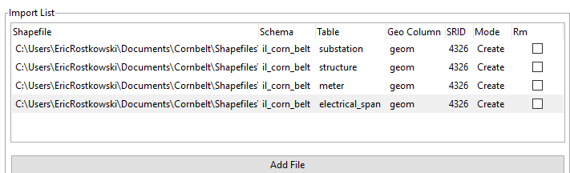

# Importing data into pgAdmin

When we recieve new client data, typically the data is in a geodatabase that we cannot directly import into our pgAdmin database, so the first step is to save the data to your local drive, unzip the gdb, and then open QGIS.

### Opening GDB in QGIS

* Under the "Layer" tab at the top of QGIS, select "Add Layer", then "Add Vector Layer..."

* Select which layers you want to bring in from the GDB and hit okay on any transformation pop-ups.
* On the bottom right of QGIS, there should now be a number after "EPSG:". Note this number, as it is the SRID projection number of your client.

### Save layers as shapefiles in QGIS
* Right click on the layer, "Export", "Save Feature as..."
* Check that the Format is "ESRI Shapefile".
* Select the name and location of the shapefile.
* Check that the CRS value is the same EPSG number as in the bottom right of QGIS.

## Import Shapefiles into pgAdmin
There are 3 ways to import shapefiles into pgAdmin. Each are detailed below.

### Command Line
This method allows for shapefiles to be imported from your local drive to pgAdmin through the Windows Command Terminal.

`shp2pgsql -s <prj> <your\file\path\here> <schema.yourtablename> | psql -U <yoursuperusername> -h <localhost> -p 5432 -d <yourdatabase>`

* Change "prj" to SRID projection number for your client.
* Change "your\file\path\here" to full file path name of the .shp file you wish to import.
* If working in the standardize db, change "schema.yourtablename" to your client's schema name and the layer name.
  * example: cvec.structure
* Change "yoursuperusername" to conexondesign if working in pgaws.
* Change "localhost" to Conexon-design-1.ckdkui5rb8xx.us-east-1.rds.amazonaws.com if working in pgaws.
* Change "yourdatabase" to standardize if working in pgaws.
* The command will ask for the password to the database. Reach out to another designer if you do not already know it.

### QGIS Connection
Connecting pgAdmin directly to QGIS is the most efficient way (in my opinion) of importing shapefiles to pgAdmin. Having this connection is nice because it allows you to view the spatial attributes of your database and make changes to the database directly through QGIS.

* On the left side of QGIS, in the browser panel, locate the PostGIS elephant logo, right click and select "New Connection"
* Set Name to "standardize'
* Set Host to "Conexon-design-1.ckdkui5rb8xx.us-east-1.rds.amazonaws.com"
* Set Port to "5432"
* Set Database to "standardize"
* Hit OK
* Username is "conexondesign"
* Reach out to another designer for the password to pgaws if you do not already have it

All of the inputs above will be for the pgaws standardize database, if you are connecting to your local database or any of the client databases, these will be different.

Once the connection is made. All you need to do is to drag the new shapefiles into the schema of you choice.

### PostGIS Shapefile Importer/Exporter
The PostGIS shapefile Importer/Exporter allows you to import or export multiple shapefiles between pgAdmin and your local drive. When you dowloand pgAdmin onto your computer, it should also download this app.

##### Make your connection
* Set Username to: "conexondesign"
* Reach out to another designer for the password to pgaws if you do not already have it
* Set Server Host to: "Conexon-design-1.ckdkui5rb8xx.us-east-1.rds.amazonaws.com"
* Set Port to: "5432"
* Set database to: "standardize"

##### Import Shapefiles
* Make sure the "Import" tab is selected near the top
* Select "Add File" and select the shapefiles you with to import
* Set the schema to your client's schema name within the standardize db
* Make sure the table column is what you want the layer to be named with the database
* Set SRID to your clients SRID projection number
* Hit Import

