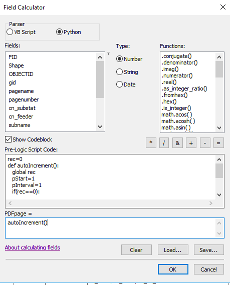
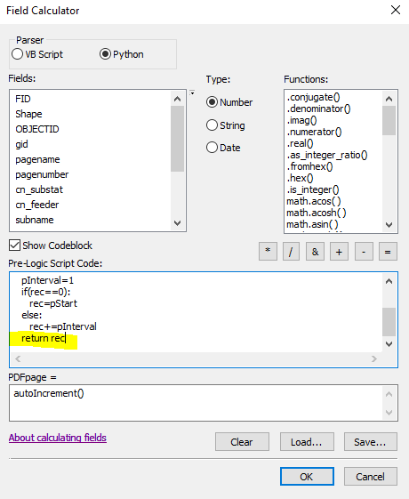

# Creating Staking Grids by Work Order

1. Select by location
    * Selection method
      * Select features from
    * Target layers
      * StakingGrid1500 or StakingGrid3000
    * Source layer
      * Auto design cable
    * Spatial selection method for target layer feature(s)
      * Intersect the source layer feature
      
      
2. Export data
    * Export the selected grids from StakingGrid1500 or StakingGrid3000 to a shapefile
    
3. Sort
    * Use the search operation to look for the **Sort (Data Management)** tool
    * Input dataset
      * The exported staking grid shapefile 
    * Output Dataset
      * Select an output dataset or leave the default
    * Field(s)
      * pagenumber 
        * Leave the sort method as ASCENDING
        
4. Add field “PDFpage”, long integer

5. Calculate PDFpage 
   * Use the sorted shapefile to populate the PDFpage field
   * Make sure that the field PDFpage = 0 
     * If it does not, calculate the field 
       * PDFpage = 0
   * Next, copy and paste the script below to the code block in field calculator. Make sure that the parser is set to Python and the type is number. Do **NOT** leave an extra line after “return rec”

```
rec=0
def autoIncrement():
   global rec
   pStart=1
   pInterval=1
   if(rec==0):
      rec=pStart
   else:
      rec+=pInterval
   return rec
   ```

  * After you copy and paste the script to the code block and you double check that there is not an extra line after “return rec,” copy and paste the line below in the PDFpage = box

`autoIncrement()` 

  * This is an example of what this would look like 
  
     
