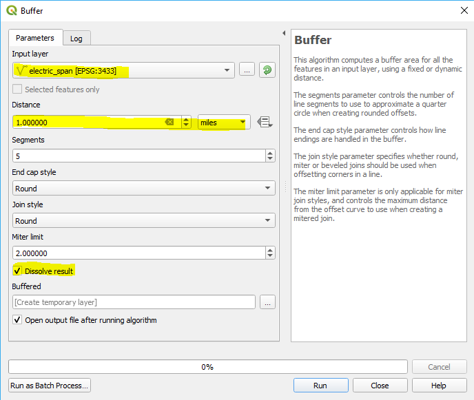

# Creating a Staking Grid for Mapbox

1. Open **QGIS** and add the electric_span layer to your map 

2. Run a buffer

    * Go to **Vector > Geoprocessing Tools > Buffer** 

    * Input layer = electric_span layer 

    * Distance = **1 mile** 

    * Leave the default values for segments, end cap style, join style, and miter limit 

    * Check **dissolve result**
    
    
3. Save temporary layer as a shapefile

    * Go to **Layer > Save As** 

    * Check that the format is a shapefile 

    * Choose an output location 

    * Choose the correct projection2 
    
 
    
4. Open **ArcMap** and add the buffer layer to your map document 

5. Go to the **Drawing** toolbar (if you do not have this, go to **Customize > Toolbars > Draw**) 

6. Draw a rectangle/square around the buffer layer using the rectangle draw tool 

    

    * If you double click on the rectangle that you have drawn over your buffer, you can change the fill color to “no color” (see example below) 
   
    * At this point you can move the edges of the rectangle closer to the buffer more easily

7. Go to the drawing toolbar dropdown arrow and select “**convert graphics to features**” 

    * Leave all of the default settings except for the output shapefile/feature class location 

    * Choose the output location 
 
 

8. Delete the rectangle graphic from your map document  

    * Select the graphic 

    * Right click and select delete 

 
9. Create the grid 

    * Use the **Search** window to search for the **Grid Index Features** cartographic tool 

    * Set the output location for your staking grid and name it **StakingGrid3000**

    * Select the staking grid polygon that you created as the input feature 

    * Check the **Use Page Unit and Scale** check box 

    * Set the map scale to 3000 

    * Set the polygon width to 11 inches 

    * Set the polygon height to 8.5 inches 

    * Leave the default values for x coordinate, y coordinate, number of rows, and number of columns 

    * Double check that the starting page number = 1 

    * Leave start labeling from the origin unchecked 

 

10. Add fields “subcode”, “pagename”, “pagenumber” (text, 250) 

    * Fields “pagename” and “pagenumber” will already be added from the grid index features tool, but these fields MUST be lowercase NOT the default “PageName” and “PageNumber”
    

11. Check that all of the fields have been added to the shapefile 

12. Once all fields have been added, the shapefile can be sent to Luisa, Megan, or Beth to run the Python script for attribution 
